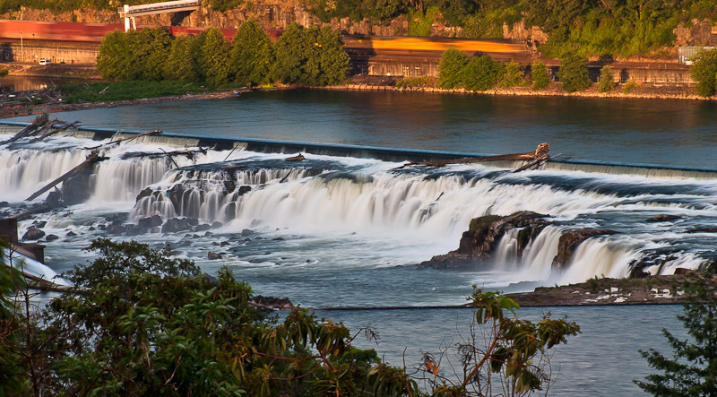

# Overview

Willamette Falls, located on the Willamette River in Clackamas County, Oregon is the largest waterfall by volume in the United States with a 42 foot drop (Northwest Waterfall Survey). The waterfall halts migration patterns of different fish species that use the river, so a fish ladder was implemented to allow for further migration. This code will consist of a time series analysis looking at patterns of ladder use between three fish species. The three species being examined from the data set include Coho Salmon, Jack Coho Salmon, and Steelhead Trout. 


```{r setup, include=TRUE, message = FALSE, warning = FALSE}
knitr::opts_chunk$set(echo = TRUE, message = FALSE, warning = FALSE)

# attach packages
library(tidyverse)
library(here)
library(broom)
library(janitor)
library(lubridate)
library(tsibble)
library(feasts)
library(kableExtra)
library(patchwork)
```

```{r}
fish <- read_csv(here("data", "willamette_fish_passage.csv")) %>% 
  clean_names()

fish_NA_0 <- replace(fish, is.na(fish), 0)

fish_ts <- fish_NA_0 %>% 
  mutate(date = mdy(date)) %>% 
  as_tsibble(key = NULL, index = date) %>% 
  select(project, date, coho, jack_coho, steelhead)
```

## Time Series Visualizations {.tabset .tabset-fade}

### Original Time Series

```{r}
coho_plot <- ggplot(data = fish_ts,
       aes(x = date, y = coho)) +
  geom_line(color = "dodgerblue3") + 
  labs(title = "Daily Coho Salmon \nRecords in Willamette \nFalls from 2001-2010",
       x = "Date",
       y = "Individual Count") +
  theme(plot.title = element_text(hjust = 0.5),
        plot.background = element_rect(fill = "aliceblue"))

jack_plot <- ggplot(data = fish_ts,
       aes(x = date, y = jack_coho)) +
  geom_line(color = "dodgerblue3") +
  labs(title = "Daily Jack Coho Salmon \nRecords in Willamette \nFalls from 2001-2010",
       x = "Date",
       y = "Individual Count") +
  theme(plot.title = element_text(hjust = 0.5),
        plot.background = element_rect(fill = "aliceblue"))

steelhead_plot <- ggplot(data = fish_ts,
       aes(x = date, y = steelhead)) +
  geom_line(color = "dodgerblue3") +
  labs(title = "Daily Steelhead Trout \nRecords in Willamette \nFalls from 2001-2010",
       x = "Date",
       y = "Individual Count") +
  theme(plot.title = element_text(hjust = 0.5),
        plot.background = element_rect(fill = "aliceblue"))

wrap_plots(coho_plot, jack_plot, steelhead_plot)
```

**Figure 1.** *In order from left to right:* (A) Daily Coho Salmon Records in Willamette Falls from 2000-2010; (B) Daily Jack Coho Salmon Records in Willamette Falls from 2000-2010; and (C) Daily Steelhead Trout Records in Willamette Falls from 2000-2010. These graphs illustrate the pattern of ladder use of each species during this 10-year time period.

#### Summary

- Both Coho And Jack Coho Salmon use the Fish Ladder later in the year; Steelhead Trout use it more consistently throughout the year.
- Between these years, it appears that the Coho Salmon population has increased substantially based on the amount of individuals going through the fish ladder.
- Between the years of 2006 an 2010 for Steelhead Trout, there was a substantial decrease in ladder use than in previous years by the species.

### Seasonplots

```{r}
coho_season <- fish_ts %>% 
  gg_season(y = coho) +
  labs(title = "Seasonal Records \nof Coho Salmon in \nWillamette Falls \nfrom 2001-2010",
       x = "Month",
       y = "Individual Count") +
  theme(plot.title = element_text(hjust = 0.5),
        plot.background = element_rect(fill = "aliceblue"),
        legend.position = "none") +
  guides(color = guide_legend(nrow = 5))

jack_season <- fish_ts %>% 
  gg_season(y = jack_coho) +
  labs(title = "Seasonal Records of \nJack Coho Salmon \nin Willamette Falls \nfrom 2001-2010",
       x = "Month",
       y = "Individual Count") +
  theme(plot.title = element_text(hjust = 0.5),
        plot.background = element_rect(fill = "aliceblue"),
        legend.position = "none")

steelhead_season <- fish_ts %>% 
  gg_season(y = steelhead) +
  labs(title = "Seasonal Records of \nSteelhead Trout in \nWillamette Falls \nfrom 2001-2010",
       x = "Month",
       y = "Individual Count") +
  theme(plot.title = element_text(hjust = 0.5),
        plot.background = element_rect(fill = "aliceblue"),
        legend.position = "right") +
  guides(color = guide_legend(ncol = 1),
         size = guide_legend(cex = 0.5))

wrap_plots(coho_season, jack_season, steelhead_season)
```

**Figure 2.** *From left to right:* (A) Seasonal Records of Coho Salmon in Willamette Falls from 2000-2010; (B) Seasonal Records of Jack Coho Salmon in Willamette Falls from 2000-2010; and (C) Seasonal Records of Steelhead Trout in Willamette Falls from 2000-2010.

#### Summary

- Coho and Jack Coho Salmon are found using the ladder during autumn, with most recorded occurrences happen in October.
- Steelhead Trout are found to use the ladder between the months of January-July and December each year. Most use of the ladder by this species comes in late spring and summer, between the months of April and July.
- Steelhead Trout has the longest period of ladder use, followed by Coho Salmon. Jack Coho Salmon are found to be using the ladder the least.

### Annual Counts

```{r}
fish_annual <- fish_ts %>% 
  index_by(yearly = ~year(.)) %>% 
  summarize(annual_coho = sum(coho),
            annual_jack_coho = sum(jack_coho),
            annual_steelhead = sum(steelhead))
```

**Figure 3.** Annual Totals of Three Different Fish Species in Willamette Falls between 2001 and 2010.

```{r}
fish_annual %>% 
  kbl(col.names = c("Year",
                    "Annual Totals of Coho Salmon Passage",
                    "Annual Totals of Jack Coho Salmon Passage",
                    "Annual Totals of Steelhead Trout Passage")) %>% 
  kable_styling(position = "center",
                full_width = TRUE,
                bootstrap_options = "hover")
```

#### Summary

- Coho Salmon passage populations experienced a major spike 2009: 4,048 (2008) to 25,298 (2009).
- Jack Coho Salmon passage populations fluctuated a lot between 2001 and 2010 with a low of 164 individuals (2007) and a high of 2,971 individuals (2008).
- Overall, Steelhead Trout passage populations stayed very high throughout this time period, however there was a major decline in individual passage between 2005 and 2009.

## Citations

- Data: DART Adult Passage Graphics and Text. Courtesy of U.S. Army Corps of Engineers, NWD and Chelan, Douglas, and Grant County PUDs, Yakima Klickitat Fisheries Project, Colville Tribes Fish & Wildlife (OBMEP), Oregon Department of Fish & Wildlife, Washington Department of Fish & Wildlife
- Willamette Falls. Northwest Waterfall Survey. (2020, January 1). Retrieved March 19, 2022, from https://www.waterfallsnorthwest.com/waterfall/Willamette-Falls-4074 

## End Task